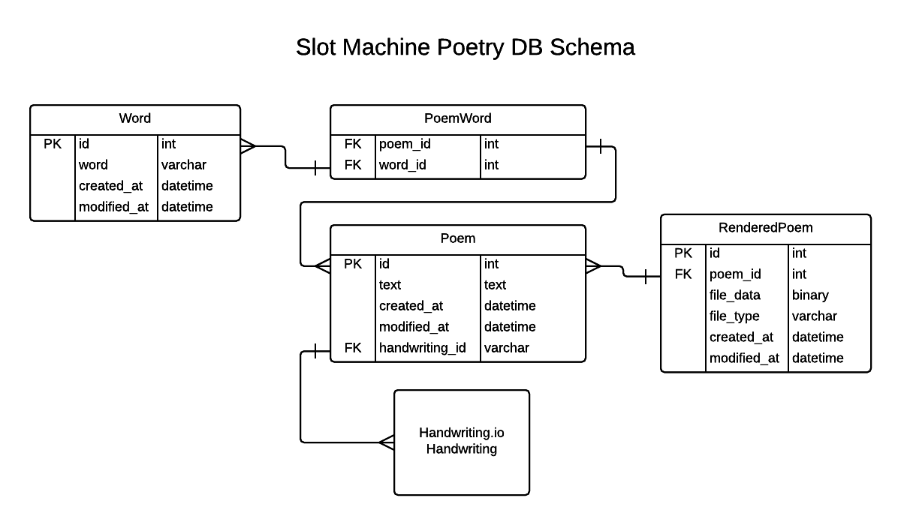

# Slot Machine Poetry API Design

## Functionality

### Essential functionality

1. Core functionality
  - Save submitted words.
  - Fetch random words.
  - Fetch sets of words, identified by id
  - Save submitted poems.
  - Fetch random poems.
  - Fetch specific poems.
2. Validation of submitted words / poems.
3. Handwriting via handwriting.io API
  - Fetch preview of poems in handwriting.
  - On poem submission, save rendered poem PNG and PDF.
  - Fetch rendered poem PNG and PDF.
4. Add seed data
  - 1000 most basic English words
  - 20 seed poems

  Additionally, must also set up any configuration necessary for deployment on Heroku.

### Optional but advised

1. Refactor image / pdf storage out of database.
2. Implement better method for random record selection.

### Future / optional features

1. Consider security questions
2. Spam / pornography prevention

## Development phases

1. Develop core functionality, as documented in [Functionality](#functionality).
2. (?) Refactoring and refinement of core features.
3. Ready app for deployment and deploy.
4. Develop all other essential API features.
5. Redeploy etc.

These should be reflected on the client.

## DB Schema

Note: For our initial proof of concept application, rendered poems (png or pdf files) will
be stored as binary blobs in the database. In the long term, an alternative storage solution
should be implemented.

## API Endpoints

### Summary

Method  | Endpoint        | Role
--------|-----------------|-----------------------------
GET     | /word           | Get words
POST    | /word/submit    | Save word & get random words
POST    | /poem/submit    | Save poem & get random poem
GET     | /poem/{id}      | Get poem
GET     | /poem/{id}/png  | Get poem png
GET     | /poem/{id}/pdf  | Get poem pdf
GET     | /poem/preview   | Get poem preview
GET     | /handwritings/  | Get list of handwriting.io handwritings 

### Details

#### GET /word - Get word(s)

##### Response (Status 200)

Type: application/json

    [
      {
        "id": 0,
        "text": "string",
        "created_at": "string",
        "modified_at": "string"
      }
    ]

##### Parameters

Parameter   | Value       | Description           | Parameter Type  | Data Type
------------|-------------|-----------------------|-----------------|------------------
pk__in      | (optional)  | pks of items to fetch | query           | array of integers

#### POST /word/submit - Save word and get random words

Choosing to use this URL to make clear its distiction from create operation of conventional CRUD.

##### Response (Status 200)

Array of randomly selected word(s).

Type: application/json

    {
      results: [
        {
          "id": 0,
          "text": "string",
          "created_at": "string",
          "modified_at": "string"
        }
      ]
    }

##### Parameters

Parameter   | Value             | Description           | Parameter Type  | Data Type
------------|-------------------|-----------------------|-----------------|-----------
word        | (required)        | word being saved      | body            | string

#### POST /poem/submit - Save poem & get random poem

Choosing to use this URL to make clear its distiction from create operation of conventional CRUD.

##### Response (Status 200)

Array of randomly selected poem(s).

Type: application/json

  {
    results: [
      {
        "id": 0,
        "text": "string",
        "words" : [0]
        "handwriting_id": "string",
        "created_at": "string",
        "modified_at": "string"
      }
    ]
  }

##### Parameters

Parameter       | Value       | Description               | Parameter Type  | Data Type
----------------|-------------|---------------------------|-----------------|------------------
text            | (required)  | poem text                 | body            | string
words           | (optional)  | ids of related words      | body            | array of integers
handwriting_id  | (required)  | id of chosen handwriting  | body            | string

#### GET /poem/{id} - Get poem

##### Response (Status 200)

Type: application/json

    {
      "id": 0,
      "body": "string",
      "handwriting_id": "string",
      "created_at": "string",
      "modified_at": "string"
      "words" : [
        {
          "id": 0,
          "text": "string",
          "created_at": "string",
          "modified_at": "string"
        }
      ]
    }

##### Parameters

Parameter       | Value       | Description | Parameter Type  | Data Type
----------------|-------------|-------------|-----------------|-----------
id              | (required)  | Poem id     | path            | string

#### GET /poem/{id}/png - Get poem png

##### Response (Status 200)

Type: image/png

    Binary image data

##### Parameters

Parameter       | Value       | Description | Parameter Type  | Data Type
----------------|-------------|-------------|-----------------|-----------
id              | (required)  | Poem id     | path            | string

#### GET /poem/{id}/pdf - Get poem pdf

##### Response (Status 200)

Type: application/pdf

    Binary pdf data

##### Parameters

Parameter       | Value       | Description | Parameter Type  | Data Type
----------------|-------------|-------------|-----------------|-----------
id              | (required)  | Poem id     | path            | string

#### GET /poem/preview - Get poem preview

##### Response (Status 200)

Type: application/json (?)

    {
      "preview": "base64 encoded string"
    }

##### Parameters

Parameter       | Value       | Description               | Parameter Type  | Data Type
----------------|-------------|---------------------------|-----------------|-----------
body            | (required)  | poem body                 | query           | string
handwriting_id  | (required)  | id of chosen handwriting  | query           | string

#### GET /handwritings/ - Get list of handwriting.io handwritings

##### Response (Status 200)

See [Handwriting.io api doc](https://handwriting.io/docs/api/#!/default/get_handwritings)

##### Parameters

See [Handwriting.io api doc](https://handwriting.io/docs/api/#!/default/get_handwritings)
